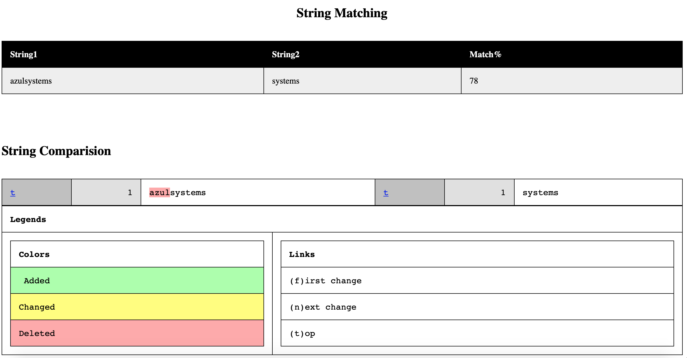
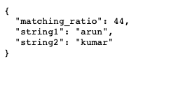
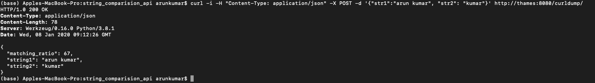

# String Matching API

This is an API that matches two strings and gives the percentage match

**Installation:**
1. Load the tar
    `docker load -i ./string_matching_api.tar`
2. run the image
    `docker run -it -p 8080:8080  string_matching_api`

**Usage:**

1. Main page:
    This url will provide a web based clear discription of the match percentage between the two strings with the difference between the two strings 
    URL EXAMPLE: http://xyz:8080/arun/kumar/      
    
    

2. Dump page:
    This url will provide a json with both the strings and the match percentage  
    URL EXAMPLE: http://xyz:8080/dump/arun/kumar/    
    

3. Curl Dump:
    This is to dump the string via curl command  
    COMMAND EXAMPLE: `curl -i -H "Content-Type: application/json" -X POST -d '{"str1":"arun kumar", "str2": "kumar"}' http://xyz:8080/curldump/`    
    

